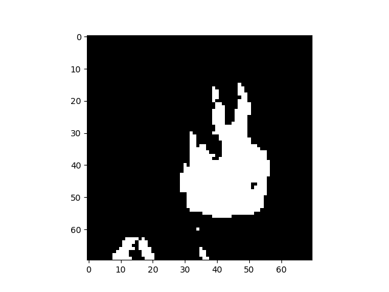

# conways game of life simulater

## example
  
<br>

  

### usage  
1. install requirements from terminal with `pip install -r 'requirements.txt'`  
2. in app.py within app() make a new board from an img or csv  
```python
# example using img data  
brd = board(board.img_to_board(*path_to_img, board_w = *desired_board_width))  

# exmaple using csv data  
brd = board(board.csv_to_board(*path_to_csv, board_w = *desired_board_width))  

# game loop u dont need to do this yourself just change the board within app.py  
while True:  
    brd.show()
    brd.update()
```
3. run the program from the terminal  
`python3 -u './app.py'`  
